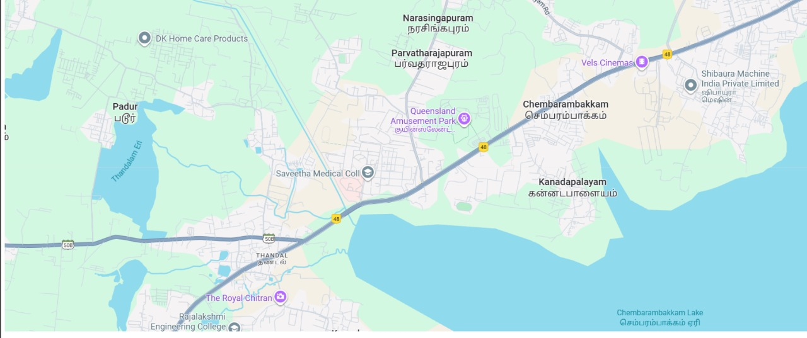

# Ex04 Places Around Me
## Date: 09-10-1025

## AIM
To develop a website to display details about the places around my house.

## DESIGN STEPS

### STEP 1
Create a Django admin interface.

### STEP 2
Download your city map from Google.

### STEP 3
Using ```<map>``` tag name the map.

### STEP 4
Create clickable regions in the image using ```<area>``` tag.

### STEP 5
Write HTML programs for all the regions identified.

### STEP 6
Execute the programs and publish them.

## CODE
```
<!DOCTYPE html>
<html lang="en">
<head>
    <meta charset="UTF-8">
    <meta name="viewport" content="width=device-width, initial-scale=1.0">
    <title>Document</title>
</head>
<body>
    <!-- Image Map Generated by http://www.image-map.net/ -->


<map name="image-map">
    <area target="" alt="Simats" title="Simats" href="Simats.html" coords="602,226,389,348" shape="rect">
    <area target="" alt="padur" title="padur" href="padur.html" coords="208,184,76" shape="circle">
    <area target="" alt="lake" title="lake" href="lake.html" coords="1057,371,211" shape="circle">
    <area target="" alt="vels" title="vels" href="vels.html" coords="922,83,1033,122" shape="rect">
    <area target="" alt="queens" title="queens" href="queens.html" coords="729,193,108" shape="circle">
</map>
    
</body>
</html>


<!DOCTYPE html>
<html lang="en">
<head>
    <meta charset="UTF-8">
    <meta name="viewport" content="width=device-width, initial-scale=1.0">
    <title>Document</title>
    <style>text="yellow"</style>
</head>
<body>
    <h1>lake</h1>
</body>
</html>


<!DOCTYPE html>
<html lang="en">
<head>
    <meta charset="UTF-8">
    <meta name="viewport" content="width=device-width, initial-scale=1.0">
    <title>Document</title>
    <style>text="yellow"</style>
</head>
<body>
    <h1>padur</h1>
</body>
</html>


<!DOCTYPE html>
<html lang="en">
<head>
    <meta charset="UTF-8">
    <meta name="viewport" content="width=device-width, initial-scale=1.0">
    <title>Document</title>
</head>
<body>
    <h1>queens</h1>
</body>
</html>


<!DOCTYPE html>
<html lang="en">
<head>
    <meta charset="UTF-8">
    <meta name="viewport" content="width=device-width, initial-scale=1.0">
    <title>Document</title>
</head>
<body>
    <h1>Simats</h1>
</body>
</html>

<!DOCTYPE html>
<html lang="en">
<head>
    <meta charset="UTF-8">
    <meta name="viewport" content="width=device-width, initial-scale=1.0">
    <title>Document</title>
</head>
<body>
    <h1>vels</h1>
</body>
</html>
```
## OUTPUT


## RESULT
The program for implementing image maps using HTML is executed successfully.
